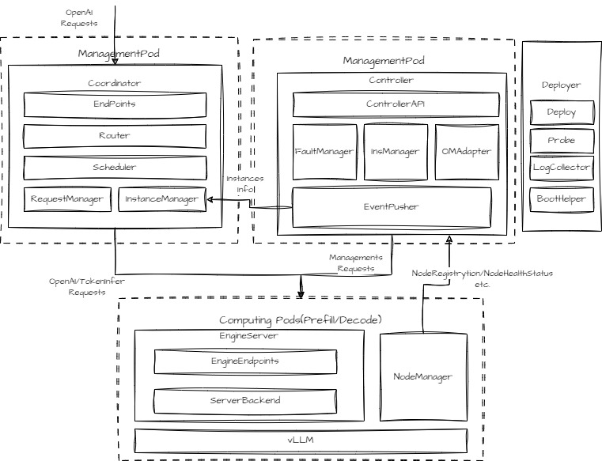

# MindIE PyMotor架构
## MindIE PyMotor简介
**MindIE PyMotor** 是面向大语言模型（LLM）分布式推理，如**PD分离推理**（Prefill 与 Decode 阶段分离）的请求调度框架。它通过开放、可扩展的推理服务化平台架构，向下对接 [vLLM-Ascend](https://github.com/vllm-project/vllm-ascend)，旨在满足大语言模型的高性能推理需求。
### 核心能力
MindIE PyMotor 主要提供以下两个方面的能力：
1. **PD分离的请求调度**：主要将外部的客户请求分发到负载最低的 Prefill/Decode 实例上，起到**负载均衡**的作用。
2. **RAS（Reliability, Availability and Serviceability）**：增强 PD 分离服务的**可靠性、可用性和可服务性**。
---
## 系统架构
MindIE PyMotor 及其周边组件的交互架构图如下所示：

**图1 MindIE Motor架构图**

---
## 关键组件与模块说明
MindIE PyMotor核心组件定义如下：
### 1. Coordinator
作为用户推理请求的**统一入口**，负责接收高并发请求，执行请求调度、管理与转发，是整个集群的数据流枢纽。
- **Endpoint**：对外提供 RESTful 接口，包括业务面接口OpenAI接口; 管理面接口：健康探针、Metrics等。
- **Router**：提供请求路由转发能力。
- **Scheduler**：负载均衡调度器。
- **RequestManager**：请求管理器，请求全局信息统计与管理。
- **InstanceManager**：同步实例的健康状态，辅助负载均衡调度，隔离故障实例。

### 2. Controller
作为集群的**状态管控器和决策大脑**，负责全局业务状态管控及 RAS 能力决策。 
- **FaultManager**：故障管理模块，负责接收故障上报并执行隔离、重启、自愈恢复等操作。
- **InsManager**：实例管理器，负责 PD 实例身份（Prefill 或 Decode）的分配与动态调整。
- **CCAEReporter**：运维管理信息上报，将实例状态及 Metrics 信息同步至[CCAE](https://www.hiascend.com/software/ccae)等运维管理平台。
- **EventPusher**：事件推送器，同步实例状态信息给Coordinator。

### 3. Deployer
基于Kubernetes的推理**服务部署**参考脚本，提供服务启动、停止、弹性伸缩等能力。 
- **Deploy**：一键启动服务、停止脚本工具。
- **Probe**：[健康探针](https://kubernetes.io/zh-cn/docs/tasks/configure-pod-container/configure-liveness-readiness-startup-probes/)配置脚本。
- **LogCollector**：k8s日志收集脚本。
- **BootHelper**：容器启动脚本，自动配置环境变量。

### 4. EngineServer
节点推理服务入口，提供统一的RESTful EndPoints，包括OpenAI接口、Metrics等。北向对接Coordinator和Controller，南向对接vLLM/SGLang/MindIE框架。（当前版本仅支持vLLM)

### 5. NodeManager
 节点级服务管理器，提供如下能力：
- **节点级服务进程启动**：向Controller注册，获取实例身份，并拉起本节点的推理服务进程(EngineServer, vLLM等)。
- **节点级健康状态管理**：监控推理服务子进程状态，并向Controller上报健康状态和心跳。

### 4. 周边组件
- **[vLLM-Ascend](https://github.com/vllm-project/vllm-ascend)**: vLLM加速引擎，提供模型实例加速能力。
- **[MindCluster](https://gitcode.com/Ascend/mind-cluster)**: 昇腾集群使能组件，提供Kubernetes底层支持能力，PD分离 CRD定义和配套Operator
- **[CCAE](https://www.hiascend.com/software/ccae)**(可选)：华为算存网一体化运维可视化平台。
