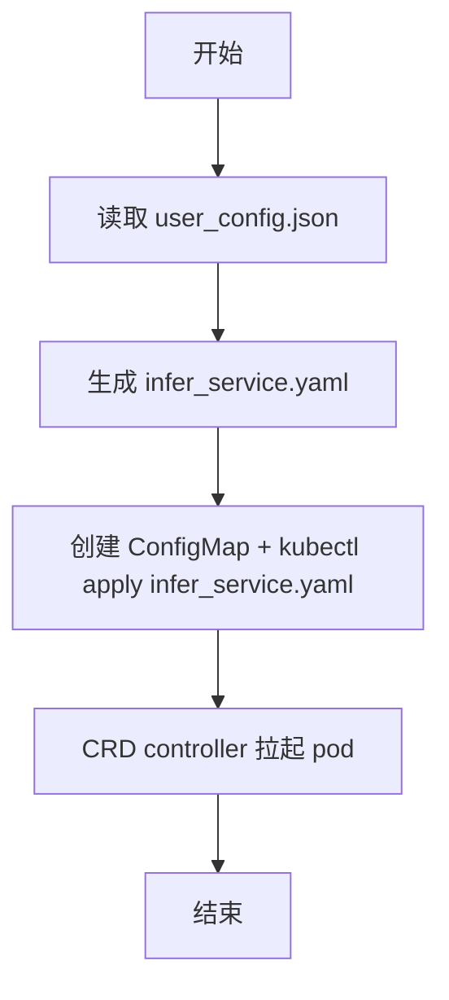
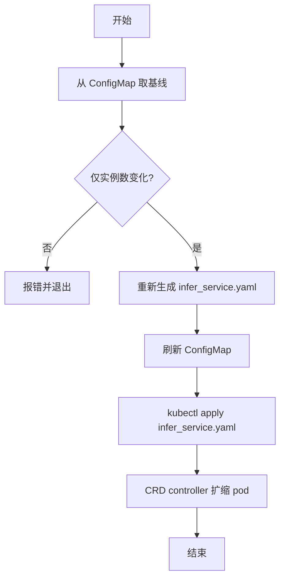

# CRD 方式部署设计文档（MindIE PyMotor）

## 背景与目标

本文用于说明 MindIE PyMotor 基于 InferServiceSet CRD 的部署方式设计与实现。

目标：
- 支持通过 **InferServiceSet CRD**（`mindcluster.huawei.com/v1`）统一拉起 controller、coordinator、prefill、decode 等角色对应的 pod。
- 使用 `infer_service_init.yaml` 作为 init 模板，经 deploy.py 根据 `user_config.json` 实例化后输出可用的 `infer_service.yaml`。
- 默认采用 InferServiceSet 方式部署；在 `user_config.json` 的 `motor_deploy_config.deployment_backend` 中配置为 `multi_deployment` 可切换回传统的多 yaml Deployment 方式。扩缩容与 CM 刷新时从集群 ConfigMap 读取当前部署方式。
- CRD 方式下，扩缩容通过重新生成并 apply InferServiceSet 实现，由 CRD controller 负责 pod 的创建与更新。

## 设计概述

### 部署模式

部署模式由 `user_config.json` 中 `motor_deploy_config.deployment_backend` 决定（不配置时默认为 `infer_service_set`）。扩缩容（`--update_instance_num`）与刷新 ConfigMap（`--update_config`）时，均以集群 ConfigMap 的 baseline 中的 `deployment_backend` 为准；若 user_config 中修改了该字段、与 baseline 不一致则报错，不允许在该场景下切换部署方式。

| 模式 | motor_deploy_config.deployment_backend | 说明 |
|------|--------------------------------------|------|
| infer_service_set | `infer_service_set`（默认，可省略） | 仅生成并 apply `infer_service.yaml`，内含 RBAC + InferServiceSet；由 CRD controller 拉起 pod |
| multi_deployment | `multi_deployment` | 生成 controller、coordinator、engine_*、kv_pool 等多个独立 yaml，分别 apply |

### InferServiceSet 资源组成

`infer_service_init.yaml` 为多文档 YAML，按顺序包含：

1. **ServiceAccount**：`mindie-motor-controller`（controller 所需）
2. **ClusterRole**：`mindie-controller-role`（configmaps/nodes 的 get/list/watch）
3. **ClusterRoleBinding**：`mindie-controller-binding`（绑定上述 ServiceAccount 与 ClusterRole）
4. **InferServiceSet**：定义 controller、coordinator、prefill、decode 四个角色的 workload 与 services

### 实例化策略

deploy.py 的 `generate_yaml_infer_service_set` 根据 user_config 对模板进行实例化，主要填充：

- **namespace**：取自 `motor_deploy_config.job_id`
- **replicas**：每 role 有两处 replicas
  - `role.replicas`：实例数目（controller/coordinator 固定为 1；prefill 为 `p_instances_num`；decode 为 `d_instances_num`）
  - `role.spec.replicas`：对应 multi_yaml 下每个 Deployment 的 pod 数（controller/coordinator 主备时为 2；prefill 为 `single_p_instance_pod_num`；decode 为 `single_d_instance_pod_num`）
- **image**：取自 `motor_deploy_config.image_name`
- **InferServiceSet metadata.name**：用于 prefill/decode 的 app label、container name、JOB_NAME 基、服务域名构建等
- **role.services**：不添加 metadata，由 CRD controller 按命名规则创建 K8s Service
- **env**：ROLE、JOB_NAME、CONTROLLER_SERVICE、COORDINATOR_SERVICE 等
  - prefill/decode 的 **JOB_NAME**：deploy.py 设置初值为 `{namespace}-{InferServiceSet.metadata.name}`；pod 启动后 CRD 会注入 `INFER_SERVICE_INDEX`、`INSTANCE_INDEX`，boot.sh 中会据此刷新为 `{namespace}-{InferServiceSet_name}-{INFER_SERVICE_INDEX}-p/d{INSTANCE_INDEX}`
- **NPU 资源**：根据 `p_pod_npu_num`、`d_pod_npu_num` 配置
- **nodeSelector**：根据 `hardware_type`（800I_A2 / 800I_A3）
- **RBAC**：ServiceAccount 的 `metadata.namespace`、ClusterRoleBinding 的 `metadata.namespace` 及 `subjects[].namespace` 更新为部署 namespace

### ConfigMap 策略

infer_service_set 与 multi_deployment 共用同一 ConfigMap 逻辑：`create_motor_config_configmap` 将 `user_config.json`、boot.sh、probe 等写入 `motor-config` ConfigMap，供各 pod 挂载使用。

## 关键流程

### 1. 首次部署（infer_service_set 模式）

1. 读取 `user_config.json`。
2. 根据 `infer_service_init.yaml` 和 user_config 生成 `infer_service.yaml`。
3. `exec_all_kubectl_multi` 内：创建 ConfigMap `motor-config`，再对 `infer_service.yaml` 执行 `kubectl apply`（包含 RBAC + InferServiceSet）。
4. CRD controller 根据 InferServiceSet 拉起各角色 pod。

#### 流程图

### 2. 扩缩容（--update_instance_num，infer_service_set 模式）

1. 从集群 ConfigMap 读取基线；若不存在则报错。
2. 校验仅实例数变更，否则报错。
3. 重新生成 `infer_service.yaml`（prefill/decode 的 replicas 已更新）。
4. 用当前输入 user_config 刷新 ConfigMap。
5. 对 `infer_service.yaml` 执行 `kubectl apply`，CRD controller 根据新 spec 扩缩 pod。

#### 流程图

### 3. 部署模式与 CM 校验

- 首次部署时从 `user_config.json` 的 `motor_deploy_config.deployment_backend` 读取模式（缺省为 `infer_service_set`）。
- 扩缩容时从集群 ConfigMap 的 baseline 读取当前 `deployment_backend`，按该模式执行扩缩，无需用户再次指定。
- **禁止在 update 场景下修改 deployment_backend**：
  - `--update_config`：显式校验；若 `user_config.json` 中的 `deployment_backend` 与集群 baseline 不一致则报错，禁止通过仅刷新 CM 切换部署方式。
  - `--update_instance_num`：通过 `validate_only_instance_changed` 校验；仅允许修改 `p_instances_num`、`d_instances_num`，修改 `deployment_backend` 会导致 config 与 baseline 差异，报错退出。

## 场景介绍

### 环境与前置

- 准备可用的 `user_config.json`（含合法 `p_instances_num`、`d_instances_num` 等）。
- 确保集群已安装 MindCluster infer-operator。
- `deployment/infer_service_init.yaml` 存在且格式正确。

### 应用场景

| 场景 | 步骤 | 预期 |
|------|------|------|
| 首次部署（infer_service_set） | `motor_deploy_config` 中不配置或配置 `"deployment_backend": "infer_service_set"`，执行 `python3 deploy.py` | 成功；生成 `output/deployment/infer_service.yaml`；RBAC 与 InferServiceSet 被 apply；ConfigMap motor-config 存在；CRD controller 拉起 controller/coordinator/prefill/decode pod；服务能正常推理 |
| 首次部署（multi_deployment） | `motor_deploy_config` 中配置 `"deployment_backend": "multi_deployment"`，执行 `python3 deploy.py` | 成功；生成 controller、coordinator、engine_*、kv_pool 等多个 yaml；分别 apply；各 Deployment 拉起对应 pod；服务可以正常推理 |
| infer_service_set 扩容 | 调大 `p_instances_num` 或 `d_instances_num`，执行 `python3 deploy.py --update_instance_num` | 成功；重新生成 infer_service.yaml；apply 后 CRD controller 扩展 prefill/decode pod |
| infer_service_set 缩容 | 调小实例数，执行 `python3 deploy.py --update_instance_num` | 成功；InferServiceSet 中 replicas 减小；apply 后 CRD controller 回收多余 pod |
| 无 infer_service_init | 删除或移走 infer_service_init.yaml，执行 infer_service_set 模式部署 | 报错：InferServiceSet init yaml not found |
| 修改 deployment_backend 后仅刷新 CM | 首次 infer_service_set 部署后，将 user_config 中 `deployment_backend` 改为 `multi_deployment` 并执行 `--update_config` | 报错：deployment_backend 不能通过刷新 ConfigMap 修改，需重新部署 |
| 修改 deployment_backend 后扩缩容 | 首次 infer_service_set 部署后，将 user_config 中 `deployment_backend` 改为 `multi_deployment` 并执行 `--update_instance_num` | 报错：仅允许修改 p_instances_num/d_instances_num，deployment_backend 变更视为非法 |

## 与 multi_deployment 模式对比

| 维度 | infer_service_set 模式 | multi_deployment 模式 |
|------|----------|-----------------|
| 输出文件 | 单个 infer_service.yaml（含 RBAC + InferServiceSet） | 多个：controller、coordinator、engine_p0～pn、engine_d0～dn、kv_pool |
| apply 对象 | RBAC + InferServiceSet | 各 Deployment、Service、RBAC 等 |
| pod 创建方 | CRD controller | kubectl apply 直接创建 Deployment |
| 扩缩容 | 更新 InferServiceSet 内 prefill/decode 各 role 的 replicas（实例数）并 apply | 对新增/删除的 engine yaml 做 apply/delete |
| 前置依赖 | 集群需安装 MindCluster infer-operator | 无 infer-operator 依赖 |
