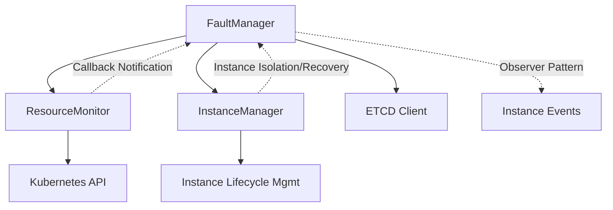
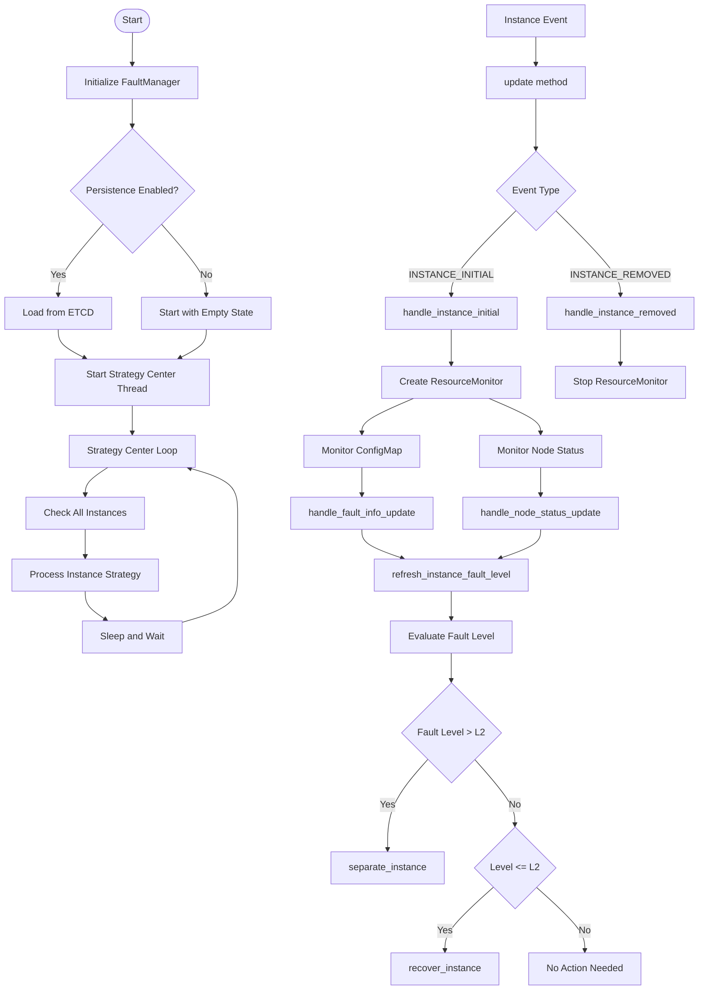
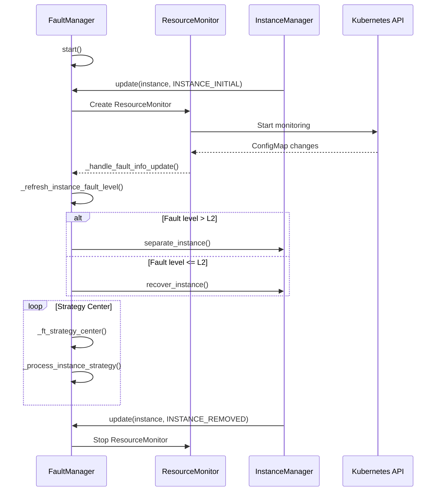

# FaultManager 故障管理器工作流程分析

## 概述

FaultManager 是 MindIE-PyMotor 系统中负责故障容错管理的核心组件。它通过观察者模式监听实例生命周期事件，协调 ResourceMonitor 进行故障检测，并与 InstanceManager 进行实例隔离和恢复操作。

## 核心组件交互



**文本版组件关系：**

```text
FaultManager (核心控制器)
├── ResourceMonitor (故障检测) → Kubernetes API
├── InstanceManager (实例管理) → 实例生命周期管理
├── ETCD Client (数据持久化)
└── 观察者模式 ← 实例事件
```

## 工作流程图



**文本版简化流程：**

```text
启动 → 初始化 → 策略中心循环
                    ↓
实例事件 → update() → 故障检测 → 故障评估 → 实例操作(隔离/恢复)
                    ↓
ResourceMonitor → 监控ConfigMap → 回调FaultManager → 刷新故障级别
                    ↓
策略中心 → 检查实例 → 执行策略 → 等待下一轮
```

## 交互时序图



## 详细工作流程说明

### 1. 初始化和启动阶段

**start() 方法流程：**

1. 重置停止事件（支持单例重用）
2. 创建并启动 `FaultToleranceStrategyCenter` 守护线程
3. 如果启用持久化，从 ETCD 恢复故障管理器状态数据
4. 线程开始定期执行策略中心逻辑

### 2. 观察者模式响应

**update() 方法处理：**

- **INSTANCE_INITIAL 事件：** 当新实例创建时，添加实例和服务器元数据，为每个主机创建 ResourceMonitor 开始监控
- **INSTANCE_REMOVED 事件：** 当实例被移除时，停止所有相关 ResourceMonitor，清理服务器和实例数据

### 3. ResourceMonitor 交互机制

**创建和管理：**

- 为每个主机IP创建独立的 ResourceMonitor 实例
- 每个 ResourceMonitor 监控该主机的 ConfigMap 和节点状态
- 通过回调函数 `node_change_handler` 和 `configmap_change_handler` 向 FaultManager 报告状态变化

**故障信息处理：**

- `_handle_fault_info_update()`: 处理 ConfigMap 中的设备故障信息
- `_handle_node_status_update()`: 处理节点状态变化（主要处理节点重启故障）
- 两种回调都会触发 `_refresh_instance_fault_level()` 重新评估实例故障级别

### 4. InstanceManager 交互逻辑

**实例隔离和恢复：**

- 当实例故障级别 > L2 时：调用 `separate_instance()` 强制隔离实例
- 当实例故障级别 ≤ L2 时：如果实例已被隔离，调用 `recover_instance()` 恢复实例
- 隔离实例会阻止心跳机制使其恢复活跃状态

### 5. 策略中心核心逻辑

**定期执行流程：**

1. 获取所有实例ID列表
2. 对每个实例调用 `_process_instance_strategy()`
3. 根据当前故障级别和代码选择合适的恢复策略
4. 管理策略生命周期：启动新策略、停止旧策略、检查策略完成状态

**策略处理规则：**

- **相同级别：** 检查当前策略是否完成，如果完成则重置状态
- **升级（不同级别）：** 停止当前策略，启动新策略
- **降级（不同级别）：** 不执行任何操作

## 数据结构说明

### NodeMetadata

```python
class NodeMetadata(BaseModel):
    """
    Each node metadata represents a node in the cluster.
    And An instance may have multiple nodes.
    """
    pod_ip: str = Field(..., description="Pod IP address")
    host_ip: str = Field(..., description="Host IP address")
    instance_id: int = Field(..., description="Instance ID that this node belongs to")
    node_status: NodeStatus = Field(default=NodeStatus.READY, description="node status")
    fault_infos: dict[int, FaultInfo] = Field(default_factory=dict,
                                              description="Fault information dictionary keyed by fault_code")
```

### InstanceMetadata

```python
class InstanceMetadata(BaseModel):
    """ Instance metadata for fault tolerance management. """
    instance_id: int = Field(..., description="Instance ID")
    fault_level: FaultLevel = Field(default=FaultLevel.HEALTHY, description="Current instance fault level")
    fault_code: int = Field(default=0x0, description="Fault code that trigger the current strategy")
    
    # Non-serializable fields (excluded from serialization)
    lock: Any = Field(default=None, exclude=True)
    # StrategyBase instance, using Any to avoid requiring arbitrary_types_allowed
    strategy: Any = Field(default=None, exclude=True)
    
    @model_validator(mode='after')
    def init_lock(self):
        """Initialize lock if not provided"""
        if self.lock is None:
            self.lock = threading.Lock()
        return self
    
    def model_dump(self, **kwargs) -> dict:
        """Override model_dump to exclude non-serializable fields"""
        return super().model_dump(exclude={'lock', 'strategy'}, **kwargs)
```

## 配置参数说明

- `strategy_center_check_interval`: 策略中心检查间隔（秒）
- `configmap_prefix`: ConfigMap 名称前缀
- `configmap_namespace`: ConfigMap 命名空间
- `enable_etcd_persistence`: 是否启用 ETCD 持久化
