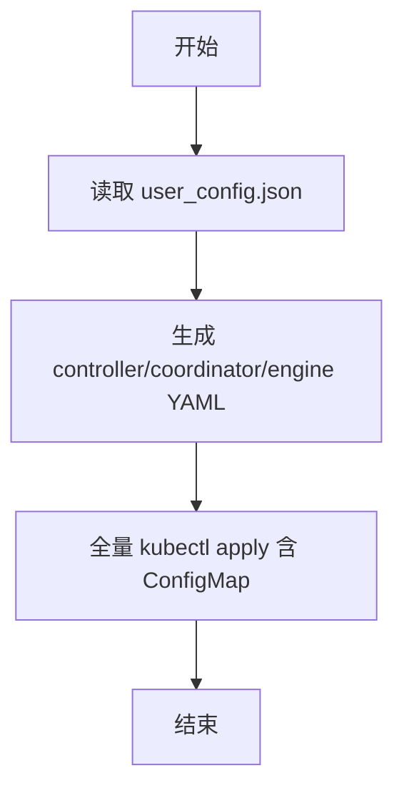
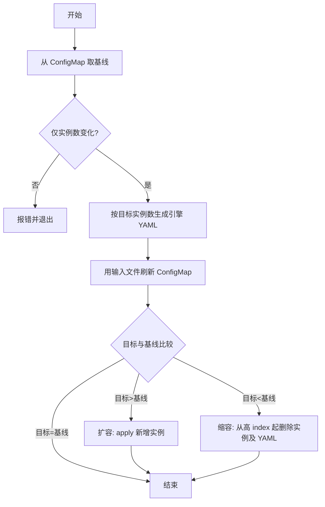

# 手动扩缩容设计文档（MindIE PyMotor）

## 背景与目标
本文用于说明 MindIE PyMotor 的手动扩缩容设计与约束。

目标：
- 以**集群内 ConfigMap（motor-config）中的 user_config** 作为扩缩容基线（当前已部署配置）。
- 仅允许 `p_instances_num/d_instances_num` 在扩缩容场景中发生变更。
- 通过 `python3 deploy.py --update_instance_num` 触发扩缩容。
- 扩缩容仅作用于 engine；已拉起的 controller/coordinator 及已有 engine 实例不会被重新 apply。

## 设计概述

### 基线配置策略
- **基线来源**：从集群中对应 namespace 的 ConfigMap `motor-config` 的 `user_config.json` 键读取，即当前环境已部署的配置。
- 首次 `deploy` 时无基线，全量 apply 后 ConfigMap 由当前输入的 `user_config.json` 路径写入。
- 扩缩容时，从 ConfigMap 取基线，与当前输入的 user_config 对比：若除实例数外有差异则拒绝执行；若仅实例数变化则执行，ConfigMap 使用当前输入的 user_config 文件路径刷新。

### 扩缩容计算与执行
- 基线实例数取自集群 ConfigMap 中 user_config 的 `motor_deploy_config`。
- 目标实例数取自当前输入的 `user_config.json` 的 `motor_deploy_config`。
- 按**目标实例数**生成引擎 YAML（仅生成 0 ～ 目标-1 的 index）。
- **扩容**：对新增 index 的 YAML 执行 `kubectl apply -f`，路径来自本次生成的 `g_generate_yaml_list`。
- **缩容**：从 **index 大往小** 依次对多余 index 执行 `kubectl delete -f`，删除成功后从 output 目录删除对应 YAML 文件。
- 已存在的 engine 实例（0 ～ 基线-1）不会被重新 apply，避免误重拉。

### ConfigMap 更新策略
- 扩缩容时刷新 ConfigMap 使用当前输入的 user_config 文件路径（`--user_config_path`）：从 CM 取基线 → 校验仅实例数变更 → 用当前输入文件刷新 ConfigMap → 执行 engine apply/delete。

## 关键流程

### 1. 首次部署
1. 读取当前输入的 `user_config.json`。
2. 生成 controller/coordinator/engine 的 YAML。
3. 执行全量 `kubectl apply`（含 create_motor_config_configmap，使用当前 user_config 文件路径）。
4. 基线即集群内 ConfigMap 内容。

#### 流程图

### 2. 扩缩容（--update_instance_num）
1. 从集群 ConfigMap 读取基线；若不存在则报错。
2. 校验仅实例数变更，否则报错。
3. 按目标实例数生成引擎 YAML。
4. 用当前输入 user_config 文件刷新 ConfigMap。
5. 根据基线实例数与目标实例数差异执行扩缩容：扩容时对新增实例执行 apply；缩容时从 index 大到小依次删除实例及其在 output 下的对应 YAML 文件。

#### 流程图

## 约束与注意事项
- 集群内需存在 ConfigMap `motor-config` 且含 `user_config.json` 才能进行扩缩容（即至少成功部署过一次）。
- 扩缩容仅支持改动 `p_instances_num/d_instances_num`。
- 扩缩容仅作用于 engine；controller/coordinator 不在扩缩容路径中更新。
- 缩容从高 index 开始删除，且会删除 output 下对应 YAML 文件。

## 新增代码结构与职责
- `get_baseline_config_from_configmap(job_id)`：从集群 ConfigMap 读取当前已部署 user_config。
- `run_cmd_get_output`：执行命令并返回 stdout，用于 kubectl get configmap。
- `validate_only_instance_changed`：除实例数外是否变更的校验。
- `elastic_distributed_engine_deploy` / `scale_engine_by_type`：按类型执行 apply/delete 及缩容时删除 YAML 文件。
- `handle_update_instance_num`：扩缩容入口；从 CM 取基线、校验、刷新 CM、执行扩缩容。

## 场景介绍

### 环境与前置
- 准备可用的 `user_config.json`（含合法 `p_instances_num`、`d_instances_num` 等）。
- 确保集群可访问，`kubectl` 已配置且对目标 namespace 有权限。

### 应用场景

| 场景 | 步骤 | 预期 |
|------|------|------|
| 首次部署 | 执行 `python3 deploy.py` | 成功；生成 `output/deployment/` 下 YAML；集群中 ConfigMap motor-config 存在。 |
| 扩容 | 将 `user_config.json` 中 P 或 D 实例数调大，执行 `python3 deploy.py --update_instance_num` | 成功；仅新增 index 的 engine 被 apply；已有 engine 未重拉；ConfigMap 更新为当前输入；`output/deployment/` 下新增对应 YAML；新增实例的pod增加。 |
| 缩容 | 将 P 或 D 实例数调小，执行 `python3 deploy.py --update_instance_num` | 成功；从高 index 起对应 engine 被 delete；`output/deployment/` 下对应 YAML 文件被删除；同时 ConfigMap motor-config 中内容被刷新；被删除实例的pod减少。 |
| 无基线时扩缩容 | 未部署过或删掉对应 namespace 的 motor-config 后执行 `python3 deploy.py --update_instance_num` | 报错：ConfigMap motor-config not found。 |
| 扩缩容时改其他配置 | 在修改实例数同时修改其他字段（如镜像等），执行 `python3 deploy.py --update_instance_num` | 报错：user_config changes detected beyond instance numbers。 |
| 实例数不合法（≤0 或 >16） | 将 `p_instances_num` 或 `d_instances_num` 设为 ≤0 或 >16，执行 `python3 deploy.py` 或 `python3 deploy.py --update_instance_num` | 报错：对应字段 must be greater than 0 或 must not exceed 16。 |
| 扩容后新实例参与处理请求 | 完成扩容后，以一定并发量持续发送推理请求（并发量需足以让负载均衡将部分请求调度到新实例） | 通过监控或日志可确认新拉起的实例也在处理请求，流量被多实例分担。 |
| 扩缩容过程中服务可用 | 执行 `python3 deploy.py --update_instance_num`（扩容或缩容），curl推理请求 | 请求可以被正常处理 |
