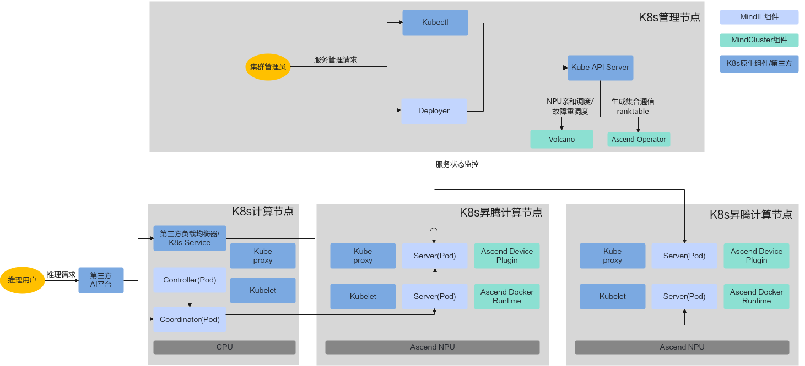
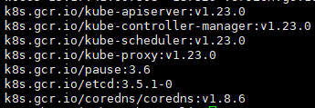
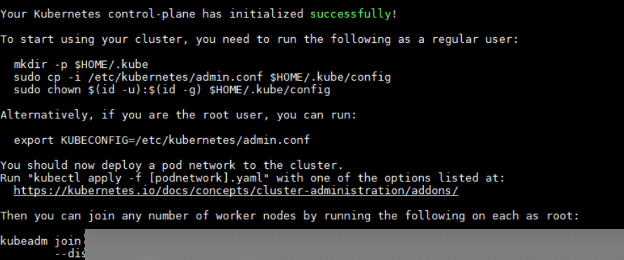
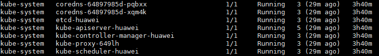
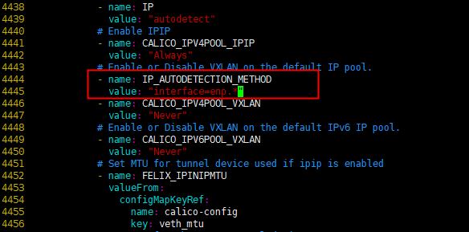
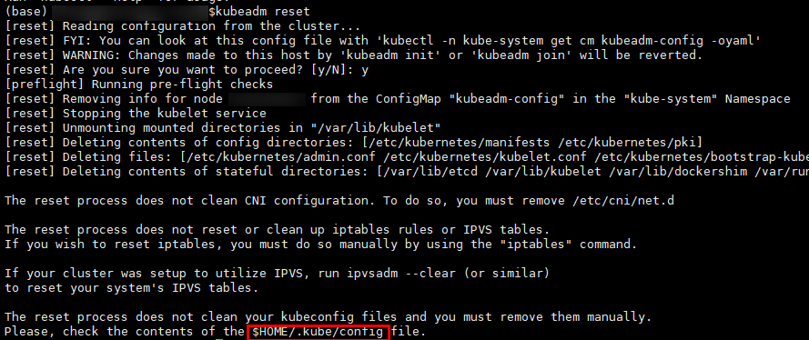
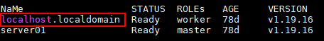
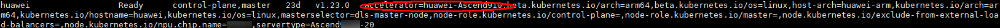

# 总述

本章节只适用于基于K8s的集群服务部署，不包含其他场景，其部署示意图如[图1 K8s集群整体部署视图](#fig698114995216)所示。

**图 1**  K8s集群整体部署视图<a name="fig698114995216"></a>  



**表 1**  部署形态

|部署形态|含义|
|--|--|
|PD分离服务|多个Server在一个或多个计算节点上联合部署，分为P实例（Prefill计算实例）和D实例（Decode计算实例），P实例与D实例分离部署，协同推理，整体作为一个Group对外提供推理服务，PD分离部署详情请参见PD分离服务部署。|

# 组件介绍

集群容器化部署依赖Kubernetes和MindCluster，具体部署场景请参考[表1 依赖列表](#table9819144513712)，Kubernetes组件详细介绍请参见[Kubernetes安装工具](https://kubernetes.io/zh-cn/docs/reference/setup-tools/)；MindCluster组件详细介绍请参见《MindCluster  集群调度用户指南》的“简介 \> [组件介绍](https://www.hiascend.com/document/detail/zh/mindcluster/730/clustersched/dlug/mxdlug_003.html)”章节。

**表 2**  依赖列表<a name="table9819144513712"></a> 

|依赖包|软件说明|管理节点是否安装|计算节点是否安装|
|--|--|--|--|
|**Kubernetes**|-|-|-|
|kubectl|Kubernetes的命令行工具。|Y|N|
|kubeadm|创建和管理Kubernetes集群工具。|Y|Y|
|kubelet|在集群中的每个节点上用来启动容器。|Y|Y|
|**MindCluster**|-|-|-|
|Ascend Device Plugin|基于Kubernetes设备插件机制，提供昇腾AI处理器的设备发现、分配和健康状态上报功能，使能Kubernetes管理昇腾AI处理器资源。需安装Ascend Docker Runtime后方可使用。|Y|Y|
|Ascend Operator|创建ranktable文件，并按照configmap映射的方式挂载到容器，可以实现多个节点NPU设备之间的数据通信和任务协调，优化集合通信建链性能。|Y|N|
|ClusterD|使用整卡调度、静态vNPU调度、动态vNPU调度、断点续训、弹性训练、推理卡故障恢复或推理卡故障重调度的用户，必须安装ClusterD。|Y|N|
|Volcano|基于开源Volcano调度插件机制，增加昇腾AI处理器的亲和性调度、故障重调度等特性，最大化发挥昇腾AI处理器计算性能。|Y|Y|
|Ascend Docker Runtime|提供docker或containerd的昇腾容器化支持，自动挂载所需文件和设备依赖。|Y|N|

# Kubernetes安装与配置

## 安装Kubernetes

**安装方式一（推荐）：**

参考[Kubernetes官网](https://kubernetes.io/zh-cn/docs/setup/)进行安装。

1. 安装Kubernetes的kubectl、kubeadm和kubelet工具。

    >[!NOTE]说明
    >- 支持Kubernetes的版本为1.18.x\~1.25.x，推荐使用1.19.x及以上版本。
    >- kubeadm和kubelet需要安装在所有节点上，kubectl只需要安装在管理节点上。

2. 使用kubeadm工具创建Kubernetes集群，安装kubeadm和创建kubernetes集群请参见Kubernetes官网中的[使用Kubeadm创建集群](https://kubernetes.io/zh-cn/docs/setup/production-environment/tools/kubeadm/create-cluster-kubeadm/)章节。

    >[!NOTE]说明
    >集群初始化过程如遇到问题，请参见《MindCluster  集群调度用户指南》的“参考 \> FAQ \> 安装时出现的故障 \> 初始化kubernetes失败”章节。

**安装方式二：**

参考阿里镜像源安装Kubernetes，以下操作均在管理节点进行。推荐使用ARM架构，请用户选择架构为ARM的软件版本。

1. 参考[阿里Kubernetes镜像官网](https://developer.aliyun.com/mirror/kubernetes?spm=a2c6h.13651102.0.0.560a1b11OvDRt7)首页进行安装Kubernetes的kubectl、kubeadm和kubelet工具。
     <br>参照阿里Kubernetes镜像官网中的“配置方法”，直接在服务器命令行中执行安装代码，可以修改安装代码以指定安装版本（例如：yum install -y **kubelet-1.23.0-00** **kubeadm-1.23.0-00** **kubectl-1.23.0-00**），以openEuler系统为例，整体安装命令示例如下。
      ```bash
      cat <<EOF > /etc/yum.repos.d/kubernetes.repo
      [kubernetes]
      name=Kubernetes
      baseurl=https://mirrors.aliyun.com/kubernetes/yum/repos/kubernetes-el7-aarch64/
      enabled=1
      gpgcheck=1
      repo_gpgcheck=1
      gpgkey=https://mirrors.aliyun.com/kubernetes/yum/doc/yum-key.gpg https://mirrors.aliyun.com/kubernetes/yum/doc/rpm-package-key.gpg
      EOF
      yum install -y kubelet-1.23.0-00 kubeadm-1.23.0-00 kubectl-1.23.0-00
      ```

    >[!NOTE]说明
    >如果出现“No match for argument: socat”或者“nothing provides socat needed by xxx”等回显信息，表示环境缺少socat库，解决方式如下所示。（其他库缺失也会有同样的回显，比如iptables、conntrack等）
    >使用以下命令自行安装缺失的库。
    >```
    >#以CentOS系统为例
    >yum install -y socat
    >#以Ubuntu系统为例
    >apt-get install -y socat
    >```

2. 执行以下命令查询部署Kubernetes需要的依赖和镜像，如[图2 所需依赖及镜像查询结果](#fig27291521143514)所示。

    ```
    kubeadm config images list
    ```

    **图 2**  所需依赖及镜像查询结果<a name="fig27291521143514"></a>  
    

    根据查询结果，用户需自行通过docker pull的方式依次进行安装，示例命令如下所示。

    ```
    docker pull k8s.gcr.io/kube-apiserver:v1.23.0
    ```
    
3. 执行以下命令清空系统网络代理环境变量。Kubernetes核心组件（kubeadm/kubelet）需直接访问API Server等服务，网络代理会拦截或篡改这类请求，可能导致Kubernetes服务不可用。
    ```
    export -n http_proxy
    export -n https_proxy
    export -n no_proxy
    ```

4.  使用以下命令初始化Kubernetes集群，当出现如[图3 Kubernetes集群初始化成功](#fig17764145015239)所示回显时，表示初始化成功。

    ```
    kubeadm init
    ```

    **图 3**  Kubernetes集群初始化成功<a name="fig17764145015239"></a>  
    
    

    然后执行[图3 Kubernetes集群初始化成功](#fig17764145015239)中的内容，如下所示：

    ```
    mkdir -p $HOME/.kube
    sudo cp -i /etc/kubernetes/admin.conf $HOME/.kube/config
    sudo chown $(id -u):$(id -g) $HOME/.kube/config
    ```

5.  执行以下命令查看当前默认启动项状态是否正常，如[图4 查看状态](#fig669924115221)所示，状态均为Running即代表kubernetes初始化成功。

    ```
    kubectl get pods -A
    ```

    **图 4**  查看状态<a name="fig669924115221"></a>  
    

6.   如出现coredns开头的服务出现非running状态，需要在k8s集群中加入网络协议框架服务，推荐使用calico框架(如果pod状态无问题可忽略本步骤)。
	<br>执行以下命令获取calico相关镜像（如果出现网络不通的问题，请重新设置网络代理环境变量）
    
      ```
      docker pull calico/kube-controllers:v3.23.5
      docker pull calico/cni:v3.23.5
      docker pull calico/node:v3.23.5
      ```
      >[!NOTE]说明
      >Kubernetes与calico的版本存在配套关系，请自行查询配套版本并下载使用。
   
   		随后，执行以下命令下载calico的yaml文件（此步骤执行完毕后需取消网络代理设置）。

      ```
      curl -k -O https://docs.projectcalico.org/v3.23/manifests/calico.yaml
      ```
    
   		执行vim calico.yaml命令修改文件，找到"CALICO_IPV4POOL_IPIP"字段（在约4444行左右），在下方添加如下内容
        ```
        - name: IP_AUTODETECTION_METHOD
        value: "interface=enp.*"
        ```
    
    	>[!NOTE]说明
    	>该内容通过正则匹配的方式查找网卡，部分环境网卡名称存在差异，部署calico前推荐通过ifconfig查找所有服务器对应ip所在的网卡名称。如：预加入集群的部分环境存在将ip配置在虚拟网卡的情况，如下例子中网卡名称为virbr0，和其他服务器不一致，calico.yaml文件的配置需要涵盖所有节点的网卡名称，此时可以将该字段配置为"interface=enp.*|virbr0"


        ```
        # ifconfig
        virbr0: flags=4163<UP,BROADCAST,RUNNING,MULTICAST>  mtu 1500
                inet 141.61.21.1  netmask 255.255.252.0  broadcast 141.61.23.255
        ```
    
    	**图 5**  修改内容展示<a name="fig17764145015239"></a>  
		
    
    	启动calico
        ```
        kubectl apply -f calico.yaml
        ```
	    重复第5步，可以观察到pod状态恢复正常。
## 重置Kubernetes设置（初始化成功后不需要执行该步骤，需要重新配置Kubernetes可执行以下重置步骤）
执行以下命令可以重置Kubernetes设置，回显如[图5 重置成功](#fig3621632193415)所示则表示重置成功。
    
    ```
    kubeadm reset
    ```

   **图 6**  重置成功<a name="fig3621632193415"></a>  
   

>[!NOTE]说明
>重置成功后，用户需手动删除_\{$HOME\}_/.kube/config文件，确保Kubernetes的配置全部删除。

## Kubernetes集群增加计算节点

整个集群仅使用一台服务器的情况下，用户无需新增计算节点，可略过下面步骤。

待新增节点需满足以下要求：

已安装Kubernetes基本软件kubeadm和kubelet。

1. 在管理节点上创建一个新增节点加入集群所需的token和ca-cert码。

    token和ca-cert码的有效期为24小时，如果已过期，请使用以下命令创建。

    -   创建token

        ```
        kubeadm token create
        ```

    -   创建ca-cert码

        ```
        openssl x509 -pubkey -in /etc/kubernetes/pki/ca.crt | openssl rsa -pubin -outform der 2>/dev/null | openssl dgst -sha256 -hex | sed 's/^.* //'
        ```

    >[!NOTE]说明
    >- 由于上述命令包含明文token，执行后可通过历史操作查询方式打印，导致敏感信息暴露，建议用户采用以下方式进行设置。
    >    - 在执行敏感命令前执行以下命令临时禁用历史操作查询功能。
    >        ```
    >        set +o history
    >        ```
    >    -   完成敏感命令操作后执行以下命令恢复历史查询功能。
    >        ```
    >        set -o history
    >        ```

2.  在新节点上执行以下命令加入集群。

    ```
    kubeadm join ip:port --token {token} \
            --discovery-token-ca-cert-hash sha256:{ca-cert码}
    ```

    参数解释：

    -   ip:port：管理节点上Kubernetes的IP地址和端口。
    -   --token：节点加入的令牌。
    -   --discovery-token-ca-cert-hash：加入集群的证书哈希值。

3.  在新节点上使用以下命令查询当前节点主机名称。

    ```
    hostname
    ```

    如节点主机名和集群中其他节点名称冲突，修改/etc/hostname文件更改节点的主机名。

4.  在管理节点上使用以下命令kubectl get nodes -A查看节点信息，如[图6 新增节点](#fig1471911375514)所示，localhost.localdomain即为新增节点。

    **图 6**  新增节点<a name="fig1471911375514"></a>  
    

5.  在管理节点上使用以下命令根据实际的NPU设备类型为新增节点打上accelerator=huawei-Ascend910或者accelerator=huawei-Ascend310x标签。

    ```
    #kubectl label nodes {节点名称} accelerator=huawei-Ascend910
    kubectl label nodes localhost.localdomain accelerator=huawei-Ascend910
    ```

6.  在管理节点上使用以下命令查看为新增节点打上的"accelerator=huawei-Ascend910"标签，如[图7 accelerator=huawei-Ascend910标签](#fig4827123110205)所示，有"accelerator=huawei-Ascend910"则表示成功。

    ```
    kubectl get nodes --show-labels
    ```

    **图 7**  accelerator=huawei-Ascend910标签<a name="fig4827123110205"></a>  
    
    

## MindCluster组件安装

集群管理组件依赖MindCluster中的Ascend Docker Runtime、Ascend Device Plugin、Volcano和Ascend Operator组件。其中Volcano和Ascend Operator组件在管理节点安装，其他组件在计算节点上安装。

1.  请参考《MindCluster  集群调度用户指南》的“安装 \> 安装部署 \> 手动安装 \> [安装前准备](https://www.hiascend.com/document/detail/zh/mindcluster/730/clustersched/dlug/dlug_installation_012.html)”章节完成创建节点标签、创建用户、创建日志目录和创建命名空间。

2.  请参考《MindCluster  集群调度用户指南》的“安装 \> 安装部署 \> 手动安装 \> [Ascend Docker Runtime](https://www.hiascend.com/document/detail/zh/mindcluster/730/clustersched/dlug/dlug_installation_017.html)”章节中的“Containerd场景下安装Ascend Docker Runtime”安装Ascend Docker Runtime。
3.  请参考《MindCluster  集群调度用户指南》的“安装 \> 安装部署 \> 手动安装 \> [Ascend Device Plugin](https://www.hiascend.com/document/detail/zh/mindcluster/730/clustersched/dlug/dlug_installation_019.html)”章节安装Ascend Device Plugin，使用device-plugin-_xxx_-v\{version\}.yaml文件进行安装。
    >[!NOTE]说明
    >当Ascend Device Plugin启动时，_xxx_.yaml配置文件中useAscendDocker参数配置为true且用户已安装Ascend Docker Runtime并生效，会自动挂载在“/usr/local/Ascend”下驱动相关目录。
4.  请参考《MindCluster  集群调度用户指南》的“安装 \> 安装部署 \> 手动安装 \> [Volcano](https://www.hiascend.com/document/detail/zh/mindcluster/730/clustersched/dlug/dlug_installation_021.html)”章节安装Volcano。
     >[!NOTE]说明
 	     >-   在单机场景下，参考《MindCluster  集群调度用户指南》的“安装 \> 安装部署 \> 手动安装 \> [Volcano](https://www.hiascend.com/document/detail/zh/mindcluster/730/clustersched/dlug/dlug_installation_021.html)”章节安装Volcano时，在执行“Volcano”章节中的步骤9前，需要修改Volcano解压后生成的volcano-v1.7.0目录下的volcano-v1.7.0.yaml文件，搜索"useClusterInfoManager"字段并将该值改为"false"，如下图所示，修改完成后，再执行“Volcano”章节中的步骤9。
5.  请参考《MindCluster  集群调度用户指南》的“安装 \> 安装部署 \> 手动安装 \> [Ascend Operator](https://www.hiascend.com/document/detail/zh/mindcluster/730/clustersched/dlug/dlug_installation_025.html)”章节安装Ascend Operator。
6.  请参考《MindCluster  集群调度用户指南》的“安装 \> 安装部署 \> 手动安装 \> [ClusterD](https://www.hiascend.com/document/detail/zh/mindcluster/730/clustersched/dlug/dlug_installation_024.html)”章节安装ClusterD。


