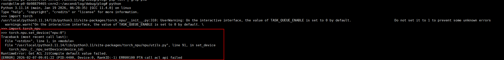
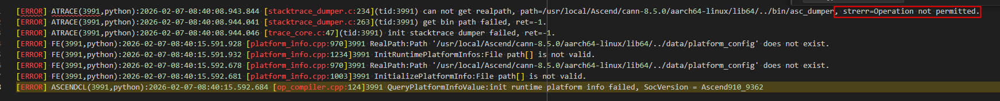
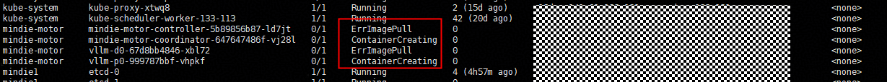

# MindIE PyMotor部署推理服务常见问题

## 1. Kubernetes节点间pod网络不通
- 问题描述
	<br>部署服务失败，PyMotor日志中显示Controller和PD实例之间的网络通信异常。
- 原因分析
	<br>大规模专家并行方案中包括通算节点和智算节点，一般情况下集群master节点和集群服务节点采用通算节点，可能会出现由于通算节点和智算节点网卡名不同，导致calico配置文件中的网卡名不适用于所有节点，因此当现场Kubernetes集群不同节点的pod出现网络不通问题时，可以参考以下思路排查处理。
- 解决方案
	<br>在master节点执行kubectl get pod -A -owide命令，查看calico和kube-proxy的pod状态是否出现异常。

	- 网络相关pod无异常（READY：1/1 + STATUS：Running，如上图所示）
	<br>如果calico和kube-proxy的pod状态无任何异常，可以尝试重启pod（直接在master节点执行以下命令，删除网络相关pod，几秒钟后对应pod会重新启动）。
  	<br>kubectl get pods -n kube-system | grep calico | awk '{print $1}' | xargs kubectl delete pod -n kube-system
 	<br>kubectl get pods -n kube-system | grep kube-proxy | awk '{print $1}' | xargs kubectl delete pod -n kube-system

	- 网络相关pod出现异常（READY：0/1）
      <br>如果pod状态出现异常，例如：某个calico的pod持续显示为 ready 0/1。
      <br><br>可以查看集群中所有节点（包括master和worker节点）的网卡名称。
      如果所有节点具有相同名称的网卡，如enp189s0f0，则在master节点执行kubectl edit ds -n kube-system calico-node命令，修改如下加粗的网卡名（如果现场网卡做了bond，则填写bond名，如bond4）：
      ```yaml
      - name: IP_AUTODETECTION_METHOD
        value: interface=enp189s0f0
      ```
      如集群中所有节点的带内管理平面网卡名不全相同，例如一部分节点为enp189s0f0，另一部分节点为enp125s0f0，则修改如下加粗的网卡名：
      ```yaml
      - name: IP_AUTODETECTION_METHOD   
        value: interface=enp189s0f0,enp125s0f0
      ```
    如果上述方法均无法解决问题，可在master节点执行kubectl describe pod -n [pod命名空间] [pod名称]以及kubectl log -n [pod命名空间] [pod名称]查看对应pod的信息和日志，分析具体原因并解决。

## 2. 部署服务时，发现日志报错 Get ACL JitCompile default value failed.
- 问题描述
	<br>服务调用torch_npu失败，查看P或者D节点的日志，出现如下报错：

- 原因分析
	<br>pod内无法使用NPU，可能CANN组件无法调用，进入pod内尝试set_device操作，通常会出现同样报错。

	<br>在pod内查看plog，进入路径~/ascend/log/debug/plog。在该目录下执行ll -rt命令筛查出最新的plog，并执行cat [最新plog文件名]命令查看最新的plog，发现运行权限不足。

- 解决方案
	<br>可参考昇腾社区[故障案例](https://www.hiascend.com/developer/blog/details/0297201752127535078)

## 3. HCCL链接异常
- 问题描述
	<br>HCCL链接失败，查看P或者D节点的日志，出现如下报错：

- 原因分析
	<br>硬件故障和相关环境变量设置出错均有可能导致该问题。
- 解决方案
    - 确保启动脚本文件夹下的deployer/env.json文件中HCCL_CONNECT_TIMEOUT环境变量取值在[120,7200]的范围内，随后登录到报错服务器上执行npu-smi set -t reset -i id -c chip_id [-m 1]对npu执行复位操作。
      ```
      设备id。通过npu-smi info -l命令查出的NPU ID即为设备id。
      chip_id:芯片id。通过npu-smi info -m命令查出的Chip ID即为芯片id。
       ```
    - 如上述操作无法解决问题，可参考昇腾社区相关[故障诊断](https://www.hiascend.com/document/detail/zh/canncommercial/850/commlib/hcclug/hcclug_000048.html)文档定位问题。
## 4. docker中存在对应镜像，但是在pod创建阶段显示拉取镜像失败
- 问题描述
    <br>执行kubectl get pod -A -owide命令，看到mindie-motor命名空间下的pod处于ErrImagePull状态

- 原因分析
	<br>Kubernetes版本低于1.23：Kubernetes 通过 Docker 的 API 操作，镜像存储在 Docker 的存储中。
	<br>Kubernetes版本高于1.23：Kubernetes 通过 CRI 与容器运行时通信，默认使用 containerd，不经过 Docker。
- 解决方案
    <br>k8s的版本较高，需要使用ctr -n k8s.io image import [imageName] 命令加载镜像。